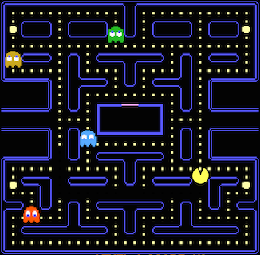

# A guide through Yaeger's internals

After reading this guide, you should have a basic picture of how Yaeger's internals work. Not everything will be covered,
but the basic setup should be clear and it should be possible to figure out how the missing parts work.

## Introduction

To get insight into how Yaeger is built, we will be using different views on its internals. We will base this on the game
of Pac-Man.

## Base classes for Scenes and Entities

